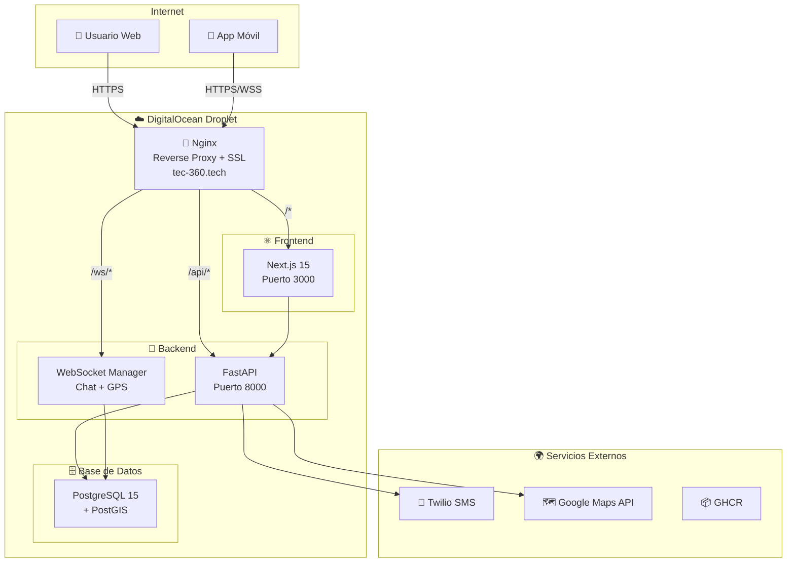
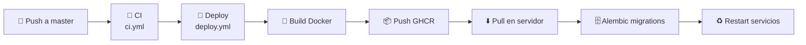

# 🛡️ Tec360 Seguridad

**Plataforma de seguridad vehicular** que conecta clientes con técnicos certificados por el SENA para instalación de GPS, alarmas, dashcams y mantenimiento de dispositivos.

> 🌐 Producción: [https://tec-360.tech](https://tec-360.tech)

---

## 🏗️ Arquitectura



---

## 🛠️ Stack Tecnológico

| Capa | Tecnologías |
|------|------------|
| **Backend** | FastAPI 0.115 · SQLModel 0.22 · PostgreSQL 15/PostGIS · Alembic · JWT · WebSockets · SlowAPI |
| **Frontend** | Next.js 15 (App Router) · React 19 · TypeScript · Tailwind CSS v4 · Framer Motion · Google Maps · shadcn/ui |
| **Mobile** | React Native 0.81 · Expo SDK 54 · expo-router · react-native-maps · expo-secure-store |
| **DevOps** | Docker Compose · GitHub Actions CI/CD · Nginx · Let's Encrypt SSL · EAS (Expo) |

---

## ✨ Funcionalidades Principales

| # | Funcionalidad | Descripción |
|---|--------------|-------------|
| 🔐 | **Autenticación OTP** | Login por teléfono con código SMS vía Twilio |
| 📍 | **Rastreo GPS en tiempo real** | Ubicación de técnicos con WebSocket + Google Maps |
| 💬 | **Chat en tiempo real** | Comunicación directa cliente ↔ técnico |
| 📋 | **Sistema de cotizaciones** | Cotizaciones con contra-ofertas y negociación |
| ⭐ | **Calificaciones bidireccionales** | Clientes y técnicos se califican mutuamente |
| 🏆 | **Gamificación de técnicos** | Niveles Bronce → Plata → Oro → Elite |
| 📸 | **Evidencia fotográfica** | Fotos antes / durante / después del servicio |
| 💰 | **Sistema de pagos** | Efectivo, transferencia bancaria |
| 📊 | **Panel de administración** | Dashboard con analíticas y gestión completa |
| 🔔 | **Notificaciones push** | Web (VAPID) + Expo Push Notifications |
| 📱 | **App móvil Android** | APK generado vía EAS Build |
| 🌐 | **PWA con soporte offline** | Progressive Web App con service worker |

---

## 📁 Estructura del Monorepo

```
tec360-seguridad/
├── 📂 backend/          # API FastAPI + modelos + migraciones
├── 📂 frontend/         # Next.js 15 App Router
├── 📂 mobile/           # React Native + Expo SDK 54
├── 📂 nginx/            # Configuración Nginx (reverse proxy + SSL)
├── 📂 .github/          # Workflows CI/CD (GitHub Actions)
├── 📂 docs/             # Documentación adicional
├── 📄 docker-compose.prod.yml
├── 📄 .env.production.example
├── 📄 AGENTS.md
└── 📄 README.md         # ← Este archivo
```

---

## 📋 Requisitos Previos

| Herramienta | Versión mínima |
|-------------|---------------|
| Node.js | 20+ |
| Python | 3.11+ |
| Docker & Docker Compose | Última estable |
| PostgreSQL + PostGIS | 15+ |

---

## 🚀 Inicio Rápido

### 1️⃣ Clonar el repositorio

```bash
git clone https://github.com/David-I-X/tec360-seguridad.git
cd tec360-seguridad
```

### 2️⃣ Configurar variables de entorno

```bash
cp .env.production.example .env.production
# Editar .env.production con tus credenciales (Twilio, Google Maps, JWT, etc.)
```

### 3️⃣ Backend

```bash
cd backend

# Levantar PostgreSQL + PostGIS con Docker
docker-compose up -d

# Instalar dependencias Python
pip install -r requirements.txt

# Ejecutar migraciones
alembic upgrade head

# Iniciar servidor de desarrollo
uvicorn app.main:app --reload --port 8000
```

> 📡 API disponible en `http://localhost:8000/docs`

### 4️⃣ Frontend

```bash
cd frontend
npm install
npm run dev
```

> 🌐 Web disponible en `http://localhost:3000`

### 5️⃣ Mobile

```bash
cd mobile
npm install
npx expo start
```

> 📱 Escanear QR con Expo Go o usar emulador Android

---

## 🚢 Despliegue

### Web (Backend + Frontend)



1. Push a `master` dispara el workflow de CI (`ci.yml`)
2. Si CI pasa, se ejecuta el deploy (`deploy.yml`)
3. Se construyen las imágenes Docker del backend y frontend
4. Las imágenes se suben a GitHub Container Registry (GHCR)
5. El servidor de DigitalOcean descarga las imágenes nuevas
6. Se ejecutan las migraciones de Alembic automáticamente
7. Los contenedores se reinician con las nuevas versiones

### Mobile

- **Build completo:** Tag `v*-mobile` → dispara EAS Build (`deploy-mobile.yml`)
- **OTA update:** Se pueden enviar actualizaciones sin rebuild con `eas update`

---

## 🔑 Variables de Entorno

Todas las variables requeridas están documentadas en `.env.production.example`:

| Variable | Descripción |
|----------|-------------|
| `DATABASE_URL` | Conexión PostgreSQL con PostGIS |
| `JWT_SECRET_KEY` | Clave secreta para tokens JWT |
| `TWILIO_ACCOUNT_SID` | Credencial Twilio para OTP |
| `TWILIO_AUTH_TOKEN` | Token Twilio |
| `TWILIO_PHONE_NUMBER` | Número Twilio para enviar SMS |
| `GOOGLE_MAPS_API_KEY` | API key de Google Maps |
| `VAPID_*` | Claves para push notifications web |
| `GHCR_TOKEN` | Token para GitHub Container Registry |

> 📝 Ver archivo [.env.production.example](.env.production.example) para la lista completa.

---

## ⚙️ CI/CD — GitHub Actions

| Workflow | Archivo | Trigger | Descripción |
|----------|---------|---------|-------------|
| 🧪 **CI** | `ci.yml` | Push/PR a `master` | Lint (ruff), tests, type check, build frontend |
| 🚀 **Deploy Web** | `deploy.yml` | Después de CI exitoso | Build Docker → GHCR → deploy en servidor |
| 📱 **Deploy Mobile** | `deploy-mobile.yml` | Tag `v*-mobile` | EAS Build (APK) u OTA update |
| 🗄️ **DB Admin** | `db-admin.yml` | Manual (`workflow_dispatch`) | Operaciones administrativas sobre la base de datos |

---

## 📚 Documentación por Módulo

| Módulo | README |
|--------|--------|
| 🐍 Backend API | [backend/README.md](backend/README.md) |
| ⚛️ Frontend Web | [frontend/README.md](frontend/README.md) |
| 📱 App Móvil | [mobile/README.md](mobile/README.md) |
| 🤖 Agentes IA | [AGENTS.md](AGENTS.md) |

---

## 📄 Licencia

Proyecto privado — © 2026 Tec360 Seguridad. Todos los derechos reservados.
