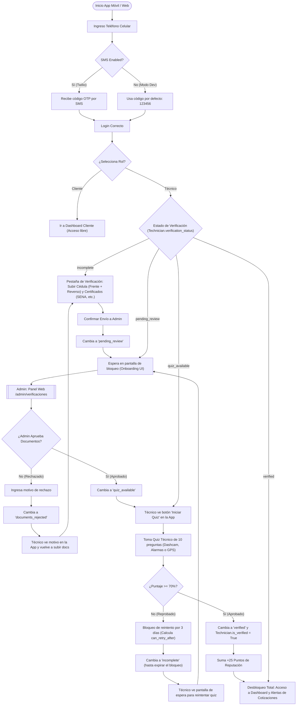
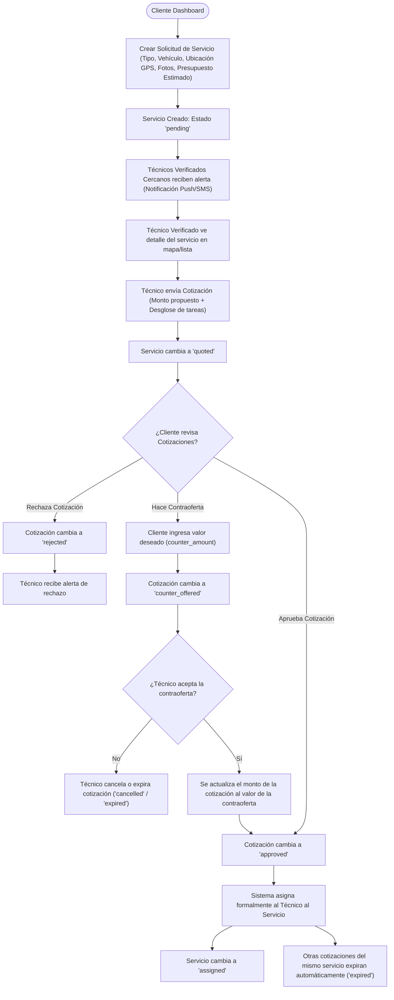

# Flujos de Procesos de Tec360 Seguridad 🔐

Este documento contiene diagramas visuales y explicaciones técnicas de los flujos del sistema de **Tec360 Seguridad**. Muestra el viaje completo tanto del **Cliente** como del **Técnico**, integrando el **Gate de Verificación**, la **Negociación de Cotizaciones**, el **Tracking en Tiempo Real por WebSockets**, el **Módulo de Pagos** y la **Gamificación de Reputación**.

---

## 📌 Índice de Contenidos
1. [Flujo 1: Registro, Autenticación y Verificación del Técnico (Gate Obligatorio)](#flujo-1-registro-autenticación-y-verificación-del-técnico-gate-obligatorio)
2. [Flujo 2: Creación de Servicio y Ciclo de Negociación (Cliente ↔ Técnico)](#flujo-2-creación-de-servicio-y-ciclo-de-negociación-cliente--técnico)
3. [Flujo 3: Ejecución de Servicio, Tracking en Vivo, Pagos y Calificación Bidireccional](#flujo-3-ejecución-de-servicio-tracking-en-vivo-pagos-y-calificación-bidireccional)
4. [Fórmulas y Reglas de Puntos (Gamificación)](#fórmulas-y-reglas-de-puntos-gamificación)
5. [Glosario de Estados del Negocio](#glosario-de-estados-del-negocio)

---

## Flujo 1: Registro, Autenticación y Verificación del Técnico (Gate Obligatorio)

Este es el proceso de onboarding para el **Técnico**. Se ha implementado un estricto **Gate de Verificación** de tres niveles (subida de documentos, aprobación por Admin y quiz de conocimiento técnico) antes de permitirle cotizar o interactuar con servicios reales.

---

## Flujo 2: Creación de Servicio y Ciclo de Negociación (Cliente ↔ Técnico)

Una vez el técnico se encuentra en estado **`verified`**, puede participar en el mercado de cotizaciones. A continuación se detalla cómo interactúan cliente y técnico para acordar el precio y la asignación del trabajo.

---

## Flujo 3: Ejecución de Servicio, Tracking en Vivo, Pagos y Calificación Bidireccional

Este flujo representa la fase operativa desde que el técnico se dirige al sitio de instalación, hasta que se procesa el pago y se recalculan los puntos de reputación de forma interactiva.

```mermaid
flowchart TD
    %% Inicio del viaje
    ServiceAssigned([Servicio Asignado]) --> TechEnRoute["Técnico presiona 'Iniciar Viaje' en la App"]
    TechEnRoute --> ServEnRoute["Servicio cambia a 'en_route'"]
    
    %% WebSocket Live Tracking
    ServEnRoute --> WSTracking["Conexión WebSocket activa: Técnico transmite su ubicación GPS cada X segundos"]
    WSTracking --> ClientMap["Cliente visualiza en tiempo real al Técnico acercándose en Google Maps (App/Web)"]
    
    %% Llegada e inicio de tareas
    ClientMap --> TechArrives["Técnico llega al lugar y presiona 'Llegué'"]
    TechArrives --> ServArrived["Servicio cambia a 'arrived'"]
    
    ServArrived --> TechStarts["Técnico presiona 'Iniciar Trabajo'"]
    TechStarts --> ServInProgress["Servicio cambia a 'in_progress'"]
    
    %% Evidencias
    ServInProgress --> UploadEvidences["Técnico toma y sube fotos de evidencia (Inicio, Proceso y Fin del trabajo)"]
    
    %% Finalización
    UploadEvidences --> TechCompletes["Técnico presiona 'Finalizar Trabajo'"]
    TechCompletes --> ServCompleted["Servicio cambia a 'completed'"]
    
    %% Módulo de Pagos
    ServCompleted --> ChoosePayment{"¿Método de Pago Seleccionado?"}
    
    %% Pago Digital
    ChoosePayment -- "Tarjeta / PSE / Nequi / Daviplata" --> DigitalGateway["Client realiza pago en App vía pasarela (Wompi)"]
    DigitalGateway --> WebhookWompi{"¿Aprobado por Wompi?"}
    WebhookWompi -- "Sí" --> PayApproved["Payment cambia a 'approved'"]
    WebhookWompi -- "No" --> PayFailed["Payment cambia a 'failed' (Reintenta pago)"]
    PayFailed --> DigitalGateway
    
    %% Pago en Efectivo
    ChoosePayment -- "Efectivo (Cash)" --> TechCollects["Técnico recibe el dinero en efectivo del Cliente"]
    TechCollects --> TechConfirmsCash["Técnico presiona 'Registrar Pago en Efectivo' en la App"]
    TechConfirmsCash --> PayTechConfirmed["Payment cambia a 'confirmed_by_technician'"]
    PayTechConfirmed --> AdminConfirmsManual[["Admin revisa y aprueba el pago en el Panel Web"]]
    AdminConfirmsManual --> PayAdminConfirmed["Payment cambia a 'confirmed_by_admin'"]
    
    %% Cierre de Servicio
    PayApproved --> ClientConfirmVehicle["Cliente confirma en la App que el vehículo funciona correctamente"]
    PayAdminConfirmed --> ClientConfirmVehicle
    
    ClientConfirmVehicle --> ServConfirmed["Servicio cambia a 'confirmed' (Cierre definitivo)"]
    
    %% Calificaciones Bidireccionales y Gamificación
    ServConfirmed --> RatingClient["Cliente califica al Técnico (1-5 estrellas + comentario)"]
    ServConfirmed --> RatingTech["Técnico califica al Cliente (1-5 estrellas + comentario)"]
    
    RatingClient --> RecalculatePoints["Sistema dispara de forma asíncrona reputation_service.recalculate()"]
    RecalculatePoints --> CalculateTiers["Recalcula rank_points y evalúa nuevo Rango del Técnico (Bronce → Plata → Oro → Élite)"]
    CalculateTiers --> UIUpdated["Badge de rango se actualiza al instante en la App del Técnico y en las propuestas del Cliente"]
    
    UIUpdated --> EndState([Servicio Exitoso y Finalizado])
    RatingTech --> EndState
```

---

## Fórmulas y Reglas de Puntos (Gamificación)

El sistema de reputación es integral y dinámico. La función de cálculo de puntos se ejecuta al finalizar cada servicio basándose en la siguiente tabla de puntuación:

### 1. Rango de Niveles y Umbrales
| Rango | Rango de Puntos | Color Badge | Emoji | Descripción |
| :--- | :--- | :--- | :--- | :--- |
| 🥉 **Bronce** | `0 a 49` | `#cd7f32` | 🥉 | Técnico nuevo en la plataforma. |
| 🥈 **Plata** | `50 a 149` | `#94a3b8` | 🥈 | Servicios completados y buenas calificaciones. |
| 🥇 **Oro** | `150 a 299` | `#eab308` | 🥇 | Experiencia sólida demostrada en la plataforma. |
| 👑 **Élite** | `300+` | `#8b5cf6` | 👑 | Máximo estatus, reservado para técnicos top calificados. |

### 2. Tabla de Asignación de Puntos
El puntaje final de reputación del técnico se calcula usando la siguiente fórmula acumulativa:

$$\text{Puntos} = \text{Servicios Completados} \times 10 + \sum(\text{Puntos de Calificaciones}) + \text{Bonos de Perfil} + \text{Bonos Académicos}$$

Donde los modificadores son:
- **Por Servicio Completado:** $+10$ puntos.
- **Por Calificación de Estrellas Recibida:**
  - $5$ estrellas ⭐⭐⭐⭐⭐: $+8$ puntos.
  - $4$ estrellas ⭐⭐⭐⭐: $+4$ puntos.
  - $3$ estrellas ⭐⭐⭐: $0$ puntos.
  - $2$ estrellas ⭐⭐: $-5$ puntos.
  - $1$ estrella ⭐: $-10$ puntos.
- **Perfil Completo:** $+15$ puntos (si tiene Avatar cargado, Bio escrita y Número telefónico verificado).
- **Certificación Oficial (SENA u otro):** $+25$ puntos por verificación oficial.
- **Por cada especialidad añadida (GPS, Alarmas, Cámaras):** $+5$ puntos por especialidad.
- **Años de experiencia declarados:** $+3$ puntos por cada año de experiencia en el área.

---

## Glosario de Estados del Negocio

Para mayor claridad técnica sobre los datos en la base de datos PostgreSQL, aquí están las descripciones de los estados principales en cada entidad:

### 1. Estados del Servicio (`ServiceStatus`)
* **`pending`**: El cliente ha publicado la solicitud y espera ofertas de técnicos.
* **`quoted`**: El servicio tiene una o más cotizaciones de técnicos enviadas y pendientes.
* **`assigned`**: El cliente ha aceptado la cotización de un técnico específico. El técnico está reservado.
* **`en_route`**: El técnico ha iniciado su viaje hacia la ubicación del vehículo y comparte su GPS.
* **`arrived`**: El técnico ha llegado físicamente al lugar donde se encuentra el vehículo.
* **`in_progress`**: El técnico ha comenzado la instalación o el mantenimiento físico del dispositivo.
* **`completed`**: El técnico ha terminado el trabajo y ha subido las fotos de evidencia requeridas.
* **`confirmed`**: El cliente ha validado el funcionamiento y cerrado la orden (permite calificar).
* **`cancelled`**: El servicio fue cancelado por el cliente o por fallas de asignación.

### 2. Estados de la Cotización (`QuotationStatus`)
* **`pending`**: Enviada por el técnico, esperando aprobación del cliente.
* **`approved`**: Aprobada por el cliente; este técnico se hace cargo del servicio.
* **`rejected`**: Rechazada explícitamente por el cliente.
* **`counter_offered`**: El cliente propone un nuevo valor y espera a que el técnico lo apruebe o lo decline.
* **`expired`**: El servicio ya fue asignado a otro técnico o pasó el límite de tiempo.
* **`cancelled`**: El técnico retiró su cotización antes de que el cliente respondiera.

### 3. Estados de Verificación del Técnico (`VerificationStatus`)
* **`incomplete`**: Estado por defecto de un nuevo técnico. No ha subido la documentación requerida.
* **`pending_review`**: El técnico ya subió sus documentos y está en cola de espera para la revisión manual del administrador.
* **`documents_approved`**: El administrador revisó y validó los documentos, lo que desbloquea el examen técnico.
* **`documents_rejected`**: El administrador rechazó uno o más documentos (requiere que el técnico re-cargue los documentos especificando un motivo).
* **`quiz_available`**: Los documentos están listos y el técnico puede tomar la prueba técnica en la App.
* **`verified`**: El técnico aprobó la prueba teórica y tiene acceso sin restricciones a cotizar en la plataforma.
