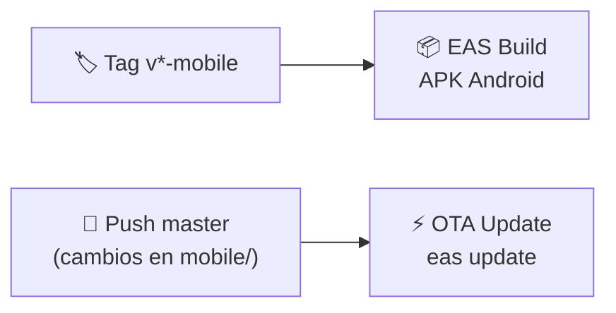

# 📱 Tec360 Seguridad — App Móvil

Aplicación móvil para clientes y técnicos de la plataforma Tec360, construida con React Native y Expo.

> 📲 Disponible como APK Android vía EAS Build

---

## 🛠️ Stack

| Tecnología | Versión | Uso |
|-----------|---------|-----|
| React Native | 0.81 | Framework de UI nativo |
| Expo SDK | 54 | Plataforma de desarrollo y build |
| expo-router | — | Navegación basada en archivos |
| TypeScript | — | Tipado estático |
| react-native-maps | — | Mapas nativos (Google Maps) |
| expo-secure-store | — | Almacenamiento seguro de tokens |
| expo-location | — | GPS y permisos de ubicación |
| expo-notifications | — | Notificaciones push (Expo Push) |
| expo-image-picker | — | Captura y selección de fotos |
| expo-haptics | — | Retroalimentación háptica |

---

## 🏗️ Estructura de Rutas

La app usa **expo-router** con 3 grupos de rutas:

```
app/
├── _layout.tsx          # Layout raíz (providers, theme)
├── index.tsx            # Redirect inicial
├── (auth)/              # 🔐 Autenticación
├── (client)/            # 👤 Pantallas de cliente
└── (tech)/              # 🔧 Pantallas de técnico
```

---

## 🔐 Pantallas de Autenticación — `(auth)/`

| Pantalla | Archivo | Descripción |
|----------|---------|-------------|
| Login | `login.tsx` | Ingreso de número telefónico |
| Verificar OTP | `verify.tsx` | Verificación del código SMS |
| Onboarding | `onboarding.tsx` | Registro de datos del usuario |
| Quiz | `quiz.tsx` | Quiz de conocimientos para técnicos |
| Verificación | `verification.tsx` | Subida de documentos del técnico |

---

## 👤 Pantallas de Cliente — `(client)/`

| Pantalla | Archivo/Ruta | Descripción |
|----------|-------------|-------------|
| Mis servicios | `services.tsx` | Lista de servicios activos |
| Nuevo servicio | `new-service.tsx` | Solicitar instalación/mantenimiento |
| Notificaciones | `notifications.tsx` | Centro de notificaciones |
| Historial | `history.tsx` | Servicios completados |
| Configuración | `settings.tsx` | Ajustes de la cuenta |
| Detalle servicio | `service/[id].tsx` | Detalle con mapa, estado, evidencia |
| Sala de espera | `waiting/[id].tsx` | Esperando técnico (cotizaciones entrantes) |
| Cotizaciones | `quotations/[id].tsx` | Ver y aceptar/rechazar cotizaciones |
| Chat | `chat/[serviceId].tsx` | Chat en tiempo real con el técnico |
| Perfil técnico | `tech-profile/[techId].tsx` | Ver perfil y reseñas del técnico |
| Editar perfil | `edit-profile.tsx` | Editar datos personales |
| Ayuda | `help.tsx` | Preguntas frecuentes |
| Soporte | `support.tsx` | Contactar soporte |
| Privacidad | `privacy.tsx` | Política de privacidad |

---

## 🔧 Pantallas de Técnico — `(tech)/`

| Pantalla | Archivo/Ruta | Descripción |
|----------|-------------|-------------|
| Dashboard | `dashboard.tsx` | Resumen: trabajos, ganancias, nivel |
| Trabajos | `jobs.tsx` | Solicitudes disponibles cerca |
| Billetera | `wallet.tsx` | Créditos, historial, compras |
| Perfil | `profile.tsx` | Perfil público del técnico |
| Detalle servicio | `service/[id].tsx` | Servicio en ejecución (foto evidencia, GPS) |
| Cotizaciones | `quotations.tsx` | Lista de cotizaciones enviadas |
| Detalle cotización | `quotation/[id].tsx` | Detalle y seguimiento de cotización |
| Chat | `chat/[serviceId].tsx` | Chat en tiempo real con el cliente |
| Editar perfil | `edit-profile.tsx` | Editar datos y portafolio |
| Soporte | `support.tsx` | Contactar soporte |

---

## 🧩 Componentes

Ubicados en `components/`:

| Componente | Archivo | Descripción |
|-----------|---------|-------------|
| 💬 Chat Screen | `chat-screen.tsx` | Pantalla de chat reutilizable (mensajes, input, WebSocket) |
| 💰 Payment Modal | `payment-modal.tsx` | Modal de confirmación/selección de método de pago |
| ⭐ Rating Modal | `rating-modal.tsx` | Modal de calificación con estrellas y comentario |
| 🏆 Tech Level | `tech-level.tsx` | Badge de nivel del técnico (Bronce/Plata/Oro/Elite) |
| 📍 Map Markers | `map-markers.tsx` | Markers personalizados para el mapa (técnico, cliente) |
| 🔗 External Link | `external-link.tsx` | Link que abre en navegador externo |
| 👆 Haptic Tab | `haptic-tab.tsx` | Tab con retroalimentación háptica |
| 👋 Hello Wave | `hello-wave.tsx` | Animación de bienvenida |
| 📜 Parallax Scroll | `parallax-scroll-view.tsx` | ScrollView con efecto parallax |
| 📝 Themed Text | `themed-text.tsx` | Texto con tema aplicado |
| 📦 Themed View | `themed-view.tsx` | View con tema aplicado |
| 🎨 UI | `ui/` | Componentes base reutilizables |

---

## 📚 Librerías (`lib/`)

| Archivo | Descripción |
|---------|-------------|
| `api.ts` | Cliente HTTP con `fetchWithAuth`, almacenamiento de tokens en `SecureStore`, refresh automático |
| `auth-context.tsx` | Context de autenticación (usuario, rol, login/logout, persistencia) |
| `notifications.ts` | Registro de Expo Push Token, manejo de permisos, listeners |
| `websocket.ts` | Manager WebSocket para chat y GPS streaming |

---

## 🎨 Tema

La app usa un **tema oscuro sci-fi púrpura** definido en `constants/theme.ts`:

| Propiedad | Valor |
|-----------|-------|
| Background | Gradientes oscuros púrpura |
| Primary | Púrpura/violeta |
| Accent | Cyan, magenta |
| Text | Blanco/gris claro |
| Cards | Fondo semi-transparente con bordes brillantes |

---

## 🚀 Setup Local

### Instalar dependencias

```bash
npm install
```

### Iniciar Expo Dev Server

```bash
npx expo start
```

> 📱 Escanear QR con **Expo Go** en tu dispositivo Android
> 💻 O presionar `a` para abrir en emulador Android

### Variables de entorno

Crear `.env` basado en `.env.example`:

| Variable | Descripción |
|----------|-------------|
| `EXPO_PUBLIC_API_URL` | URL base de la API (ej: `https://tec-360.tech/api`) |

---

## 📦 Build de Producción

### Configuración EAS

El archivo `eas.json` define 3 perfiles de build:

| Perfil | Uso | Distribución |
|--------|-----|-------------|
| `development` | Development client con depuración | Internal |
| `preview` | APK de testing interno | Internal |
| `production` | APK de producción para distribución | Store / Internal |

### Build APK

```bash
# Build de producción (APK)
eas build --platform android --profile production

# Build de preview (testing)
eas build --platform android --profile preview
```

### OTA Updates

Enviar actualizaciones over-the-air sin reconstruir el APK:

```bash
eas update --branch production --message "Descripción del cambio"
```

> ⚡ Los OTA updates se aplican automáticamente al abrir la app.

---

## 🔄 CI/CD Mobile

El workflow `deploy-mobile.yml` se activa con:

- **Tag `v*-mobile`** → EAS Build completo (genera nuevo APK)
- **Push a `master`** con cambios en `mobile/` → OTA update automático



---

## 📁 Estructura del Directorio

```
mobile/
├── app/                    # Pantallas (expo-router)
│   ├── (auth)/             # 5 pantallas de autenticación
│   ├── (client)/           # 14 pantallas de cliente
│   ├── (tech)/             # 11 pantallas de técnico
│   ├── _layout.tsx         # Layout raíz
│   └── index.tsx           # Redirect
├── components/             # 11 componentes + ui/
├── constants/
│   └── theme.ts            # Tema oscuro sci-fi púrpura
├── hooks/                  # Custom hooks
├── lib/                    # API, auth, notifications, websocket
├── assets/                 # Imágenes, fuentes, íconos
├── scripts/                # Scripts de utilidad
├── app.config.js           # Configuración Expo
├── eas.json                # Perfiles EAS Build
├── package.json
└── tsconfig.json
```

---

## 📋 Dependencias Clave

| Paquete | Uso |
|---------|-----|
| `expo-location` | Permisos y tracking GPS (foreground + background) |
| `expo-notifications` | Push notifications con Expo Push Service |
| `react-native-maps` | Mapas nativos con Google Maps |
| `expo-image-picker` | Captura de fotos de evidencia |
| `expo-secure-store` | Almacenamiento cifrado de tokens JWT |
| `expo-haptics` | Feedback háptico en interacciones |
| `expo-router` | Navegación file-based |

---

## 🔗 Enlaces

- ⬆️ [README principal](../README.md)
- 🐍 [Backend README](../backend/README.md)
- ⚛️ [Frontend README](../frontend/README.md)
